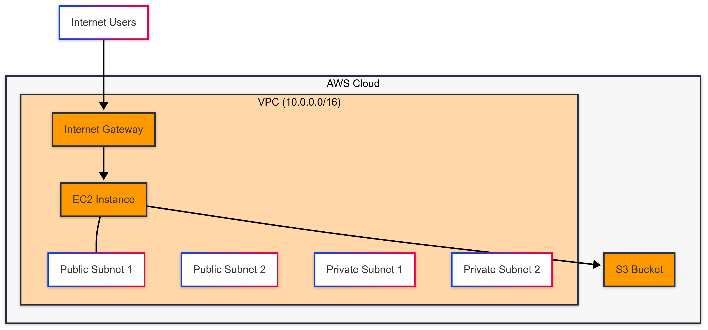

# **AWS Infrastructure as Code with Terraform**
Terraform configurations for AWS infrastructure with modular design and multi-environment support.
## **Prerequisites**

Terraform >= 1.0.0
AWS CLI >= 2.0.0
Git
Required AWS IAM Permissions:

EC2: RunInstances, DescribeInstances
VPC: Full access
S3: CreateBucket, PutObject
IAM: PassRole


## **Project Structure**
Copyaws-infrastructure-terraform/
├── environments/
│   ├── dev/
│   └── prod/
├── modules/
│   ├── ec2/
│   ├── s3/
│   └── vpc/
└── README.md
## **Features**

- Modular components (VPC, EC2, S3)
- Multi-environment support
- Infrastructure as Code (IaC)
- Automated resource tagging
- Security group management

## **Quick Start**
```bashCopy
git clone https://github.com/funke09/aws-infrastructure-terraform.git
cd aws-infrastructure-terraform/environments/dev
terraform init
terraform plan
terraform apply
```
## **Architecture**


VPC with public/private subnets
EC2 instances in public subnet
S3 bucket with private access
Security groups and routing tables

## **Security Considerations**

Encrypted S3 buckets
Private subnet isolation
Security group least privilege
IAM role-based access
Regular security audits

## **Maintenance**

### 1. State Management

Regular state backups
Lock table usage
State file encryption


### 2. Updates

Module version control
Regular provider updates
Security patch management


## **Cost Management**

- Resource cost breakdown
- Auto-shutdown for dev environment
- Right-sizing recommendations
- Cleanup procedures

## **Testing**
   ```bash
   # Validate configurations
   terraform validate

   # Check formatting
   terraform fmt

   # Run plan in test mode
   terraform plan -var-file="test.tfvars"
   ```

## **Troubleshooting**
### Common issues:

1. AWS Credentials:
   ```bashCopy
   aws configure
   aws sts get-caller-identity
   ```
2. State Conflicts:

   - Back up tfstate
   - Use state locking
   - Force-unlock if needed


3. Resource Failures:

   - Check CloudWatch logs
   - Verify IAM permissions
   - Validate security groups


## **Outputs**

- VPC ID
- Subnet IDs
- EC2 Instance IPs
- S3 Bucket Name

## **Contributing**

- Fork repository
- Create feature branch
- Submit pull request
- Follow coding standards

## **Support**

- GitHub Issues
- Documentation Updates
- Security Reports